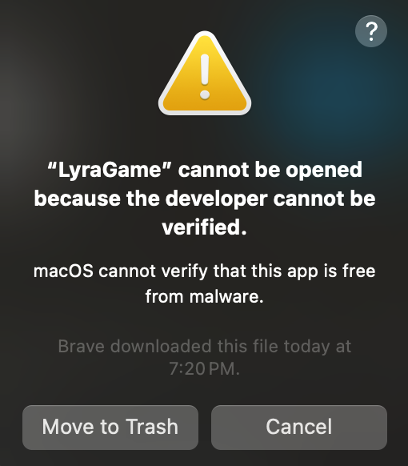
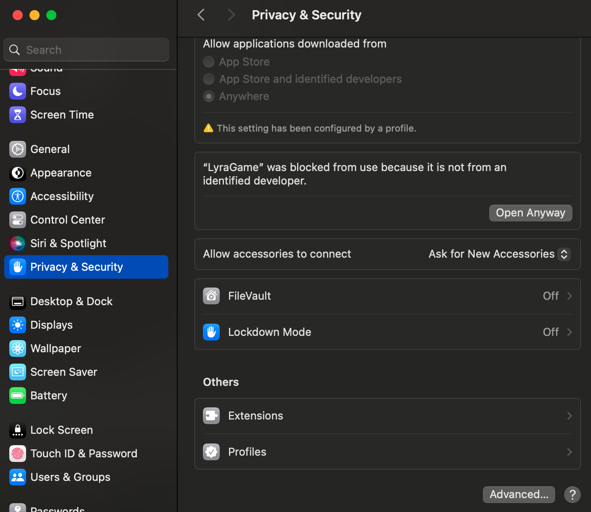

# Get Started

## Installation Guidelines - Windows
1. Download the zip file containing the game packaged [here](https://filesender.renater.fr/?s=download&token=fcf2564a-097f-4758-bfa7-038398ea42c8).
2. Unzip the file and open the `Windows` folder.
3. Launch the game by executing `LyraGame.exe`


## Installation Guidelines - Linux/Mac

To be updated soon...

## Play instructions

- The graphics option can be set in the setting menu (pause), if the game is laggy it is recommended to reduce the graphics quality.
- The control options can be set in the game settings (pause menu).

## After the experiment
1. Open and fill the feedback document [here](https://docs.google.com/forms/d/e/1FAIpQLSdoZZC3ZT3Ewh-cccVrXj3EtGGTM2CYL6U2JvzhnYbg7UDBxQ/viewform?usp=publish-editor)
2. Retrieve the content of the folder ```Windows/LyraStarterGame/Saved/``` (you can zip the folder)
3. Send us by [email](mailtto:hugo.bertin@irisa.fr) the Saved folder


<!--. You can use the [ResultsUpload folder](https://drive.google.com/drive/u/2/folders/1bKCfW1ik9K8Q6HEZWjZ4bd-QnV9Vq-ST) or by [email](/contact.md). -->


<!-- ## Launch the game

1. Start by downloading  the zip file compliant with your OS in the drive folder [here](https://drive.google.com/drive/u/2/folders/1W-ANJfaK9jgomkra-b9O7DIh3U86b4DO).
2. Unzip the file


**Windows:**
1. Open the `WindowsClient` directory in the file explorer.
2. Click on `LYRALAUNCHER.bat` to launch the game.

**Linux:** 
1. Open a terminal in the folder containing your uncompressed game folder and run the following commands:
	```
	cd LinuxClient
	./LYRALAUNCHER.sh
	```

**MAC:** 
1. Open a terminal in the folder containing your uncompressed game folder and run the following commands:
	```
	cd MacClient
	./LYRALAUNCHER.command
	```
2. The following error will be raised. This is related to the OSX app bundle not being signed by a verified developer (with an apple developer licence).


3. To bypass this, open the Settings and go to the Privacy & Security section.
4. Click on the button **Open Anyway** below the following error message should be raised: "LyraGame was blocked from use because it is not from an identified developer". 



5. **Quit the game which is currently launching** because this will open the game **BUT** won't connect it to the server. 
6. Run again `./LYRALAUNCHER.command `

-->

<!-- ## Binaries to download
[**Linux**](https://filesender.renater.fr/?s=download&token=c721fd29-b0ec-4faf-a44d-b338e59399f2)

**Mac OS (intel/M)**

**Windows** -->